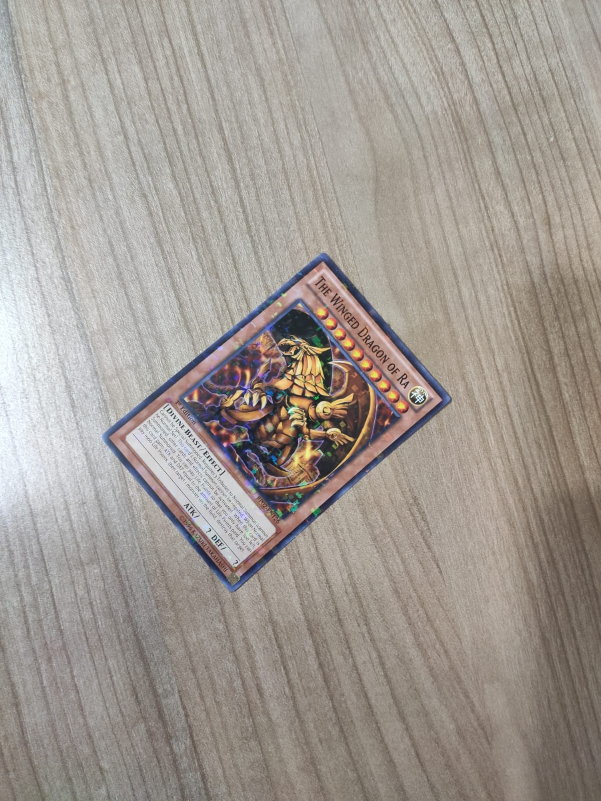
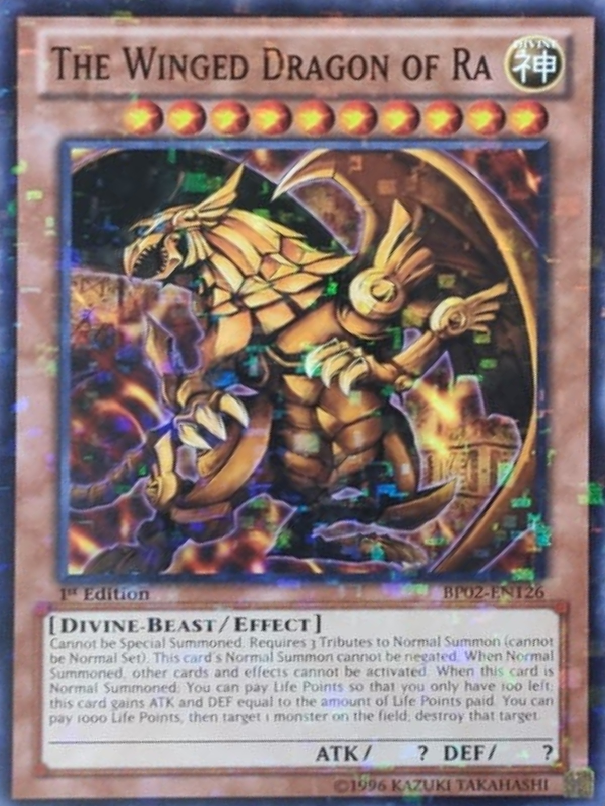

## Image warper
---

 [](https://github.com/cccaaannn/image_warper/blob/master/LICENSE)

### Usage

```shell
run.py --image_path example_images/1.jpeg
run.py --image_path example_images/1.jpeg --save_folder out -d 1920,1080
```


### Examples

 

 


